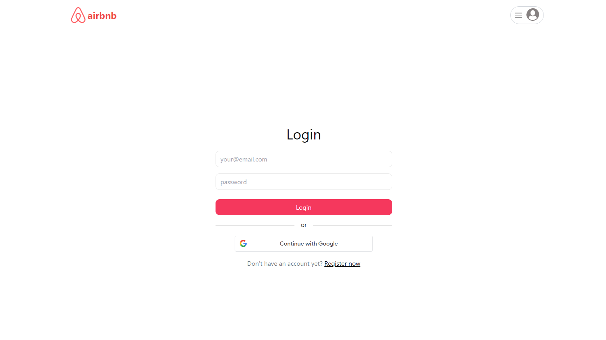
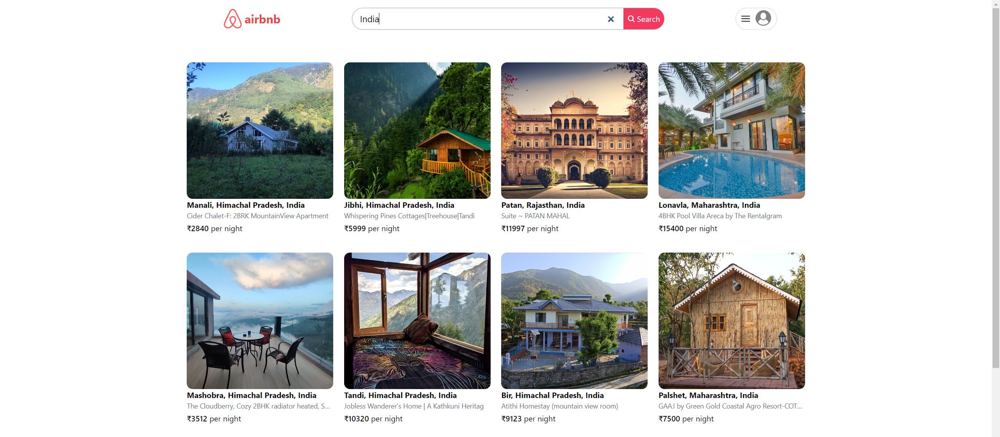

# Airbnb Clone

## Overview

This is a full-stack Airbnb clone built by **Surafeal-Dev** using the MERN stack (MongoDB, Express.js, React.js, Node.js). The application replicates Airbnb's core functionalities, allowing users to search for accommodations, view property details, make bookings, and manage their listings.

## Getting Started

### 1. Clone the Repository

```bash
git clone https://github.com/surafeal-dev/Airbnb-react.git
```

### 2. Install Dependencies

#### Frontend
Navigate to the client directory and install frontend dependencies:

```bash
cd client
yarn install
```

#### Backend
Navigate to the API directory and install backend dependencies:

```bash
cd ../api
yarn install
```

### 3. Configure Environment Variables

Create a `.env` file in both the `client` and `api` directories and add the required environment variables.

#### Client `.env` File
```
VITE_BASE_URL=http://localhost:4000
VITE_GOOGLE_CLIENT_ID=your_google_client_id
```

#### API `.env` File
```
PORT=4000
DB_URL=your_database_url
JWT_SECRET=your_secret_key
JWT_EXPIRY=20d
COOKIE_TIME=7
SESSION_SECRET=your_session_secret
CLOUDINARY_NAME=your_cloudinary_name
CLOUDINARY_API_KEY=your_cloudinary_api_key
CLOUDINARY_API_SECRET=your_cloudinary_api_secret
CLIENT_URL=http://localhost:5173
```

### 4. Run the Project

#### Start Frontend
Open a terminal, navigate to the client directory, and run:

```bash
yarn run dev
```

#### Start Backend
Open another terminal, navigate to the API directory, and run:

```bash
yarn start
```

## Features

- **User Authentication:** Secure signup, login, and logout with password hashing.
- **Google Authentication:** Users can sign up and log in using Google.
  
  

- **Search Listings:** Users can search for available accommodations.
  
  

- **View Listings:** Users can view detailed property information, including photos, descriptions, and amenities.
  
- **Make Bookings:** Authenticated users can book accommodations for specific dates.
  
- **Manage Listings:** Hosts can create, edit, and delete their listings.

- **Responsive Design:** Optimized for different devices.
 
## Technologies Used

- **MongoDB:** NoSQL database for storing user and listing data.
- **Express.js:** Backend framework for handling server logic.
- **React.js:** JavaScript library for building the frontend.
- **Node.js:** Runtime environment for executing JavaScript on the server.
- **Tailwind CSS:** Utility-first CSS framework for styling.
- **ShadCN:** UI components built on Tailwind CSS.
- **JWT:** Secure authentication using JSON Web Tokens.
- **Cloudinary:** Cloud-based image storage and management.
- **Google Cloud:** Google authentication for seamless login.

---

This project is developed and maintained by **Surafeal-Dev**. Contributions and suggestions are welcome!

